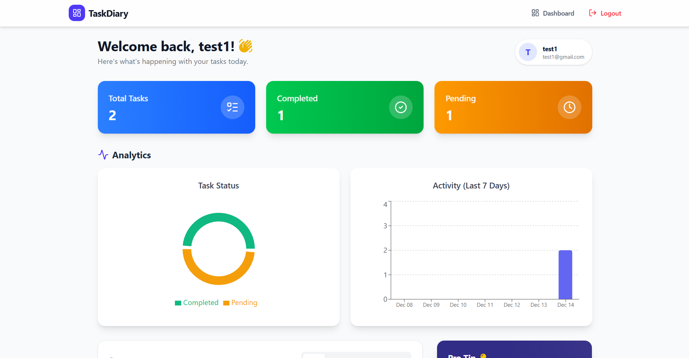
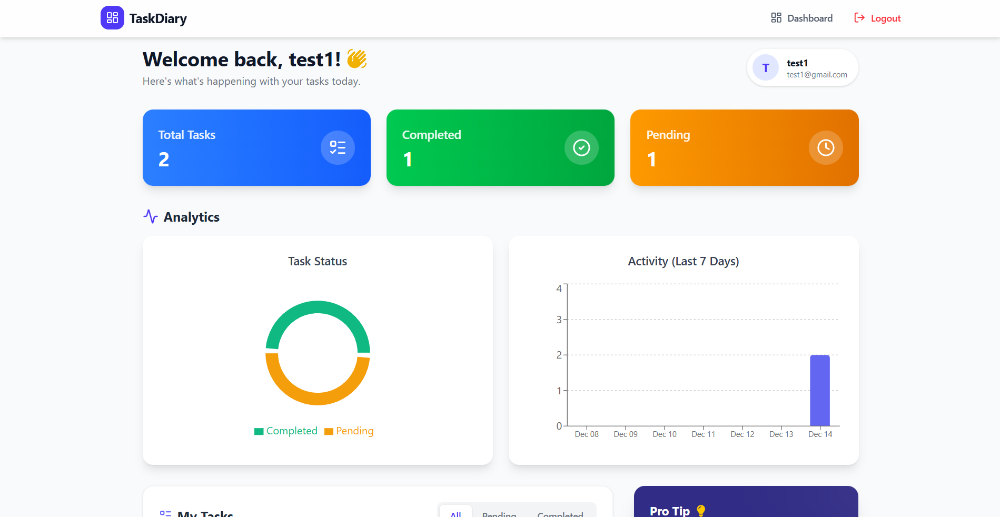

# TaskDiary 📝

> A modern, beautiful, and intuitive task management dashboard tailored for personal productivity.



**TaskDiary** is a full-stack web application designed to help users track their daily tasks with style. Featuring a stunning glassmorphism UI, real-time analytics, and seamless animations, it transforms the mundane task of "to-do" listing into a delightful experience.

## ✨ Features

- **🔐 Secure Authentication**: JWT-based Login and Signup with a beautiful split-screen UI.
- **📊 Real-time Dashboard**: visual analytics using Recharts to track task completion and activity.
- **🎨 Modern UI/UX**: Built with **TailwindCSS** and **Framer Motion** for smooth entrances and interactions.
- **📱 Fully Responsive**: Optimized for Mobile, Tablet, and Desktop with a custom adaptive Navbar.
- **⚡ Fast & Interactive**: Powered by Vite for lightning-fast HMR and performance.
- **💡 Smart Insights**: Get daily pro-tips and stats (Pending vs. Completed).

## 🛠️ Tech Stack

### Frontend
- **Framework**: [React](https://react.dev/) (Vite)
- **Styling**: [TailwindCSS](https://tailwindcss.com/)
- **Icons**: [Lucide React](https://lucide.dev/) & [React Icons](https://react-icons.github.io/react-icons/)
- **Animations**: [Framer Motion](https://www.framer.com/motion/)
- **Charts**: [Recharts](https://recharts.org/)
- **Routing**: React Router DOM

### Backend
- **Server**: Node.js & Express
- **Database**: MongoDB (Mongoose)

## 🚀 Getting Started

Follow these steps to set up the project locally.

### Prerequisites
- Node.js (v16+)
- npm or yarn
- MongoDB instance (local or Atlas)

### Installation

1.  **Clone the repository**
    ```bash
    git clone https://github.com/yourusername/task-diary.git
    cd task-diary
    ```

2.  **Setup Frontend**
    ```bash
    cd Frontend
    npm install
    npm run dev
    ```
    The frontend will run on `http://localhost:5173`.

3.  **Setup Backend**
    Open a new terminal:
    ```bash
    cd Backend
    npm install
    # Create a .env file with your credentials
    # PORT=5000
    # MONGO_URI=your_mongodb_connection_string
    # JWT_SECRET=your_jwt_secret
    npm start
    ```
    The backend will run on `http://localhost:5000`.

## 📸 Screenshots

| Login Page | Dashboard |
|------------|-----------|
|  |  |

## 🤝 Contributing

Contributions are welcome! Please fork the repository and submit a pull request for any enhancements.

1.  Fork the Project
2.  Create your Feature Branch (`git checkout -b feature/AmazingFeature`)
3.  Commit your Changes (`git commit -m 'Add some AmazingFeature'`)
4.  Push to the Branch (`git push origin feature/AmazingFeature`)
5.  Open a Pull Request

## 📄 License

Distributed under the MIT License. See `LICENSE` for more information.
